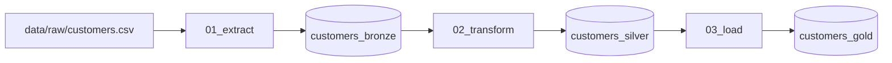

# Simple ETL on Databricks (Community / Free Edition)

A minimal **Extract → Transform → Load** pipeline deployed with **Databricks Asset Bundles**, **GitHub Pull Requests**, **GitHub Actions**, and orchestrated as a **Lakeflow Job workflow** (three notebook tasks on serverless compute).

## Architecture



| Step | Notebook | Output |
|------|----------|--------|
| Extract | `notebooks/01_extract.py` | Delta table `customers_bronze` |
| Transform | `notebooks/02_transform.py` | Delta table `customers_silver` |
| Load | `notebooks/03_load.py` | Delta table `customers_gold` |

The job definition lives in `resources/etl_job.yml` and is wired in `databricks.yml`. Tasks pass table names via **job task values** so the workflow runs in order without hard-coded paths.

## Prerequisites

1. **Databricks Community Edition or Free Edition** workspace (serverless-only; jobs are supported with account limits).
2. **Personal access token (PAT)** for the workspace user ([create token](https://docs.databricks.com/dev-tools/auth/pat.html)).
3. **Databricks CLI** locally (optional but recommended): `curl -fsSL https://raw.githubusercontent.com/databricks/setup-cli/main/install.sh | sh`
4. A **GitHub repository** for this project.

### One-time workspace setup

1. In the workspace, open `notebooks/00_setup_schema.sql` (after first deploy) or run in a SQL notebook:

   ```sql
   CREATE SCHEMA IF NOT EXISTS main.etl_demo_dev;
   CREATE SCHEMA IF NOT EXISTS main.etl_demo;
   ```

   Adjust `main` if your Free Edition catalog name differs (check **Catalog** in the UI).

2. GitHub repository **Secrets** (Settings → Secrets and variables → Actions):

   | Secret | Value |
   |--------|--------|
   | `DATABRICKS_HOST` | Workspace URL, e.g. `https://adb-1234567890123456.7.azuredatabricks.net` |
   | `DATABRICKS_TOKEN` | PAT with permission to create/run jobs |

## Local development

```bash
cd simple-etl-databricks
export DATABRICKS_HOST="https://<your-workspace>"
export DATABRICKS_TOKEN="dapi..."

databricks bundle validate -t dev
databricks bundle deploy -t dev
databricks bundle run -t dev simple_etl_workflow
```

Copy `.env.example` to `.env` for local CLI use; never commit `.env`.

## CI/CD with GitHub

| Event | Workflow | What it does |
|--------|-----------|----------------|
| Pull request → `main` | `.github/workflows/databricks-pr.yml` | `databricks bundle validate -t dev` |
| Push to `main` | `.github/workflows/databricks-deploy.yml` | validate → `bundle deploy -t prod` → `bundle run simple_etl_workflow` |
| Manual | **Actions → Databricks deploy and run** | Choose `dev` or `prod` and whether to run the job |

### Recommended PR flow

1. Create branch, change notebooks or job YAML, open PR.
2. **Databricks PR validation** must pass before merge.
3. Merge to `main` → deploy workflow updates the job and can run the ETL once.
4. In the workspace: **Workflows** → **simple_etl_workflow** → view runs, enable schedule (cron is **paused** by default in bundle config).

## Project layout

```
databricks.yml              # Bundle root (targets dev/prod)
resources/etl_job.yml         # Lakeflow Job / workflow definition
notebooks/01_extract.py
notebooks/02_transform.py
notebooks/03_load.py
data/raw/customers.csv
.github/workflows/          # PR validate + deploy
```

## Free Edition notes

- Jobs use **serverless** compute (no `new_cluster` in the job — required on Free Edition).
- Max **5 concurrent job tasks** per account; this pipeline uses 3 sequential tasks.
- Outbound network from jobs is limited; this sample only reads bundled CSV and writes Delta tables in your catalog.
- Legacy **Community Edition** is being replaced by **Free Edition**; the same bundle + Actions pattern applies to both.

## Customization

- Change cron schedule in `resources/etl_job.yml` (`schedule.pause_status: UNPAUSED` when ready).
- Point `variables.catalog` / per-target `schema` in `databricks.yml` at your catalog.
- Replace `data/raw/customers.csv` with your source file and update `raw_data_path` if needed.
